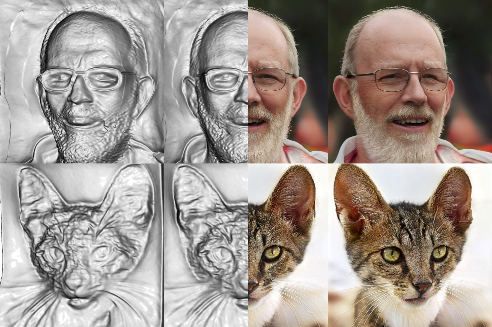

<h1 align="center">Generative Multiplane Images (GMPI)</h1>
<p align="center">Making a 2D GAN 3D-Aware</p>
<p align="center"><b>ECCV 2022 (Oral)</b></p>


<p align="center">
  
</p>

**Generative Multiplane Images: Making a 2D GAN 3D-Aware, ECCV 2022 (Oral).**<br>
[Xiaoming Zhao](https://xiaoming-zhao.com/), [Fangchang Ma](https://fangchangma.github.io/), [David Güera Cobo](https://scholar.google.com/citations?user=bckYvFkAAAAJ&hl=en), [Zhile Ren](https://jrenzhile.com/), [Alexander G. Schwing](https://www.alexander-schwing.de/), and [Alex Colburn](https://www.colburn.org/). 

### [Project Page](https://xiaoming-zhao.github.io/projects/gmpi/) | [Paper](https://arxiv.org/abs/2207.10642)

## Table of Contents

- [Environment Setup](#environment-setup)
- [Using Pretrained Checkpoints](#using-pretrained-checkpoints)
  - [Render a Single Image](#render-a-single-image)
  - [Render a Video](#render-a-video)
  - [Extract a Mesh](#extract-a-mesh)
- [Training and Evaluation](#training-and-evaluation)
- [Citation](#citation)
- [License](#license)

## Environment Setup

This code has been tested on Ubuntu 18.04 with CUDA 10.2.

```
conda env create -f environment.yml
```

## Using Pretrained Checkpoints

### Download Checkpoints
```bash
cd /path/to/this/repo
export GMPI_ROOT=$PWD
```

Please download our [pretrained checkpoints](https://drive.google.com/drive/folders/1MEIjen0XOIW-kxEMfBUONnKYrkRATSR_?usp=sharing) and place them under `${GMPI_ROOT}/ckpts`. The structure should be:
```
.
+-- ckpts
|  +-- gmpi_pretrained
|  |  +-- FFHQ256
|  |  +-- FFHQ512
|  |  +-- FFHQ1024
|  |  +-- AFHQCat
|  |  +-- MetFaces
```

We use the following variables for illustration purposes.
```bash
# This can be FFHQ256, FFHQ512, FFHQ1024, AFHQCat, or MetFaces
export DATASET_NAME=FFHQ1024
export OUTPUT_DIR=${GMPI_ROOT}/ckpts/gmpi_pretrained/${DATASET_NAME}

# Set this to your favourate seed
export SEED=589

# - When psi = 1.0 there is no truncation, which is used for quantitative results in the paper.
# - To obtain better qualitative results, use psi < 1.0.
export TRUNCATION_PSI=1.0
```

### Render a Single Image
The following command renders an image `${OUTPUT_DIR}/rendered.png`, along with:
- `mpi_alpha.png`: alpha maps for all planes,
- `mpi_rgb.png`: the same RGB texture for all planes,
- `mpi_rgba.png`: RGB-alpha images for all planes.

```bash
conda activate gmpi && \
export PYTHONPATH=${GMPI_ROOT}:${GMPI_ROOT}/gmpi/models:$PYTHONPATH && \
python ${GMPI_ROOT}/gmpi/eval/vis/render_video.py \
--ckpt_path ${OUTPUT_DIR}/generator.pth \
--output_dir ${OUTPUT_DIR} \
--seeds ${SEED} \
--nplanes 96 \
--truncation_psi ${TRUNCATION_PSI} \
--exp_config ${OUTPUT_DIR}/config.pth \
--render_single_image 1
```

Note: We use `nplanes = 96` in the paper for reporting quantitative and qualitative results, but GMPI is able to produce high-quality results even with 32 planes. Use a small `nplanes` (e.g., 32) if your run into CUDA out-of-memoory errors. 

### Render a Video
The following command renders a video in `${OUTPUT_DIR}`, along with:
- `video_rgb.mp4`: video for the RGB rendering,
- `video_depth.mp4`: video for the depth rendering.

```bash
conda activate gmpi && \
export PYTHONPATH=${GMPI_ROOT}:${GMPI_ROOT}/gmpi/models:$PYTHONPATH && \
python ${GMPI_ROOT}/gmpi/eval/vis/render_video.py \
--ckpt_path ${OUTPUT_DIR}/generator.pth \
--output_dir ${OUTPUT_DIR} \
--seeds ${SEED} \
--nplanes 96 \
--truncation_psi ${TRUNCATION_PSI} \
--exp_config ${OUTPUT_DIR}/config.pth \
--render_single_image 0 \
--horizontal_cam_move 1
```

Notes:
- Set `nplanes` to some small number (e.g., 32) if your run into CUDA out-of-memoory errors.
- Set `horizontal_cam_move` to 0 if you want a video with vertical camera motion.

### Extract a Mesh
The following command produces a mesh `${OUTPUT_DIR}/mesh_${TRUNCATION_PSI}.ply`.

```bash
conda activate gmpi && \
export PYTHONPATH=${GMPI_ROOT}:${GMPI_ROOT}/gmpi/models:$PYTHONPATH && \
python ${GMPI_ROOT}/gmpi/eval/vis/extract_mesh.py \
--ckpt_path ${OUTPUT_DIR}/generator.pth \
--dataset ${DATASET_NAME} \
--save_dir ${OUTPUT_DIR} \
--exp_config ${OUTPUT_DIR}/config.pth \
--stylegan2_sanity_check 0 \
--truncation_psi ${TRUNCATION_PSI} \
--seed ${SEED} \
--chunk_n_planes -1
```

Notes:
- Set `chunk_n_planes` to some small positive numbers (e.g., 64) if your run into CUDA out-of-memoory errors.
- It may take several minutes to extract a mesh with Marching Cubes, for resolutions of 512 or above. 

## Training and Evaluation
Please refer to [TRAIN_EVAL.md](./docs/TRAIN_EVAL.md) for more details.

## Citation
>Xiaoming Zhao, Fangchang Ma, David Güera, Zhile Ren, Alexander G. Schwing, and Alex Colburn. Generative Multiplane Images: Making a 2D GAN 3D-Aware. ECCV 2022.
```
@inproceedings{zhao-gmpi2022,
  title = {Generative Multiplane Images: Making a 2D GAN 3D-Aware},
  author = {Xiaoming Zhao and Fangchang Ma and David Güera and Zhile Ren and Alexander G. Schwing and Alex Colburn},
  booktitle = {Proc. ECCV},
  year = {2022},
}
```

## License
This sample code is released under the [LICENSE](LICENSE) terms.

### Disclaimer
Some of this software was built on Nvidia codebase, as noted within the applicable files, and such Nvidia code is available under its own terms at https://github.com/NVlabs/stylegan2-ada-pytorch.  The authors of this software are not responsible for the contents of third-party websites.